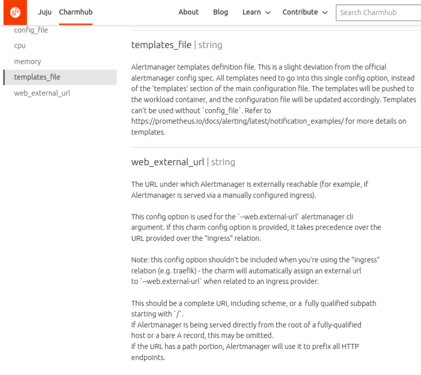

# Standards

- [Charm Configuration Option Description](#charm-configuration-option-description)
- [Charm Ubuntu and Python Version](#charm-ubuntu-and-python-version)
- [Dependencies](#dependencies)
- [Docstrings](#docstrings)
- [f-strings](#f-strings)
- [Failing Status Checks](#failing-status-checks)
- [Formatting Log Messages](#formatting-log-messages)
- [Non Compliant Code](#non-compliant-code)
- [Programming Languages and Frameworks](#programming-languages-and-frameworks)
- [Repository Setup](#repository-setup)
- [Static Code Analysis](#static-code-analysis)
- [Test Coverage](#test-coverage)
- [Test Structure](#test-structure)
- [Type Hints](#type-hints)
- [When to use Python or Shell](#when-to-use-python-or-shell)
- [Subprocess calls within Python](#subprocess-calls-within-python)

## Programming Languages and Frameworks

If we develop in many different programming languages and frameworks, the
maintenance cost increases, only those with knowledge of a given programming
language or framework can work on code bases in that programming language and
best practices and standards are difficult to set across the team.

We are a team primarily focused on developing charms, and we should follow the
recommended tools and best practices of the ecosystem we work within (and help
to improve them where appropriate). As a result, the primary programming
language we work in is Python, and the primary framework we use to develop
charms with is the [Operator
Framework](https://github.com/canonical/operator).

We will also be working on older charms which may be written in older
frameworks such as the [Reactive
Framework](https://charmsreactive.readthedocs.io/en/latest/). In some cases
we'll work on converting those to the Operator Framework but for small bug
fixes or changes this may not be the case.

As a team we'll also be exposed to a much lesser extent to other programming
languages as a result of working with specific applications that we deploy on
Juju, or via small changes to Juju itself, which is written in Go. We also
encourage exploration and experimentation in a range of programming languages
depending on the interest of the individual as part of using Canonical's
annual training budget.

## Charm Ubuntu and Python Version

Using inconsistent minor Python version for development, CI and production means
that, even if tests pass during development and CI, the charm may not work in
production.

When charms are running in production, the version of Python available to them
is dictated by the version of Ubuntu that it is running on. This is configured
in the `charmcraft.yaml` file under the `bases.build-on` and `bases.run-on`
keys. The CI should be configured to use the same version of Ubuntu as
configured under the `charmcraft.yaml` `bases.run-on` key. It is recommended
that local development be done on the version of Python that is shipped with
the Ubuntu version defined in `charmcraft.yaml` `bases.run-on`. The unit and
integration tests should be run on the same minor Python version as is shipped
with the the OS as configured under the `charmcraft.yaml` `bases.run-on` key.
With tox, for Ubuntu 22.04, this can be done using:

```
[testenv]
basepython = python3.10
```

This ensures that the tests are run on the same Python version as the charm
will be running in production, catching any issues related to mismatched Python
versions.

## Dependencies

Including an external dependency in one of our projects is a significant
choice. It can help with reducing the complexity and development cost. However,
a poor dependency pick can lead to critical issues, such as security incidents
around our software supply chain. Other impacts include:

* We may need to take over maintenance of a project if the current maintainer
  becomes inactive.
* We need to keep monitoring the dependencies for any potential issues, such as
  deprecations of features we use or retirement of the dependency in favour of
  others.
* Updating our code in case of breaking changes.

Dependencies include anything we use that is not directly developed by our
team, such as:

* a python dependency in a `requirements.txt` file,
* a Docker image and
* a GitHub action.

Different levels of scrutiny apply depending on how the dependency is used:

* Development dependency (such as a linter): lowest level of scrutiny as it is
  potentially easier to stop using a linter if any problems arise. Linters also
  generally cannot make changes to our code without the team seeing the change
  in a PR. Increased scrutiny should be applied if a tool becomes important in
  our workflow, such as the testing library we use (e.g., `pytest`).
* Build dependency (such as a GitHub action): medium to high level of scrutiny
  as the output of our build processes are used in highly sensitive
  environments. For example, the Jenkins charm our team develops is used to
  build the Ubuntu images Canonical distributes which run many sensitive and
  critical workloads. Compromising the Jenkins charm build process gives an
  attacker potential access to the build process of the Ubuntu images.
* Production dependency: high level of scrutiny, especially for charms
  operating sensitive workloads. An example is the mattermost charm which runs
  the Canonical internal chat server which holds sensitive data.

The following are helpful indicators in assessing the quality of a dependency:

* How widely adopted the dependency is. For example, `pytest` is widely used
  across the industry and well maintained reducing the chance of, for example,
  the project being abandoned or malicious code making it into a release.
  Indications of adoption can include download counts (https://pypistats.org)
  and interactions on GitHub such as forks and stars.
* How well maintained the dependency is. This indicates whether the dependency
  is under active development or potentially has been abandoned. Indicators of
  maintenance can include recent commits, recent releases and the number of
  recent open and closed pull requests and issues.
* Whether the dependency is maintained by an individual or organisation. If the
  dependency is maintained by an organisation, it is less likely that it will
  stop being maintained as there are likely multiple people looking after the
  dependency.

By carefully selecting dependencies, we can limit security and maintenance
problems arising from our use of dependencies.

## When to use Python or Shell

Shell scripts are powerful and easy to write. However, they can be challenging
to maintain as they can be difficult to read, have limited tools for testing
and are not easy to re-use through simple import statements. Charms run
production workloads, some of which are business critical, and it is important
to ensure that the code is bug free which requires extensive testing.

Limit the use of shell scripts and commands as much as possible in favour of
writing Python for charm code. This means that there needs to be a good reason
to use a shell command rather than Python. Examples include:

* Extracting data from a machine or container which can't be obtained through
  Python
* Issuing commands to applications that do not have Python bindings (e.g.,
  starting a process on a machine)

Note that, outside of charm source and test code, it is reasonable to use shell
scripts to, for example:

* Configure CI/CD
* Build docker images
* Utilities to support development

This will improve the maintainability of our charms, enable re-use and enable
the team to take advantage of the powerful tooling available through Python.

Note it is possible to run shell commands within python. [See this section.](#subprocess-calls-within-python)

## Subprocess calls within Python

When running shell utilities or programs outside of Python, such as git, Python
library bindings are preferable over invocation with subprocess call. Python
libraries may provide typed-interaction, better logging, and error handling.

In case no high-quality Python library exists, using `subprocess` in the
standard library may be needed. Without enforcing good practice, usage of 
subprocess call can be difficult to debug and leads security risks.

In such cases it is generally a good practice to:

- Log exit_code and stderr when errors occur.
- Convert to the correct exception if needed.
- Use absolute path to prevent security issues.
- Add `# nosec B603` to ignore bandit check, and add comment to explain the
  usage.

This mostly applies to spawning subprocess in other libraries as well, such as
`execute` method for LXD instance in pylxd library. Adding `# nosec B603` may
not be needed.

```Python
import subprocess

try:
  # Comment to explain why subprocess is used.
  result = subprocess.run(  # nosec B603
    ["/usr/bin/echo", "hello world"],
    capture_output=True,
    check=True,
  )
  logger.debug("Command output: %s", result.stdout)
except subprocess.CalledProcessError as err:
  logger.error("Command failed with %i: %s", err.returncode, err.stderr)
  raise
```

## Repository Setup

The repositories that store the source code for our charms are critical to the
ongoing development of our charms. They also enforce team policies around code
review and ensure business continuity. If the repository is setup poorly, it
exposes our team and Canonical to operational risks.

- GitHub should be used for charm source code and issue tracking.
- The repository should be publicly accessible.
- The `is-charms` team is added as maintainers.
- Management and director of the team that owns the charm are added as admins
  on the repository.
- Branches are auto-deleted after merging.
- The only option for merging PRs is using a squash commit.
- The default branch is called `main`.
- The default branch is protected and can only be changed using PRs.
- The number of approvers for PRs is 2.
- Approvals reset on any new commits.
- PRs can only be merged if all checks pass.
- Bypassing of the rules is disabled.

The above configuration ensures our team processes around changes are enforced
and provides access to the repository even if some team members are unavailable.

The repository will contain a `CODEOWNERS` file in its root to automatically add
the `is-charms` team as reviewer
```
*       @canonical/is-charms
```

## Failing Status Checks

The team uses GitHub actions to run CI which includes automated status checks
to verify the code works as expected. If PRs are merged with failing status
checks, there are potential bugs in the code which may lead to downtime or
other operational issues or a shared tool not working as expected.

PRs can only be merged if all status checks pass. Some exceptions could
include:

* If the team has recently taken over a new charm and changes are urgently
  needed and the test suit of the existing charm is failing for spurious
  reasons.
* A tool we depend on is not working, no previous working version is available
  and a change is urgently needed to fix a critical issue in production.

Even in the above cases it is not clear whether it is reasonable to merge a PR
with failing checks due to the high risks of ignoring failing checks that have
been adopted by the team. Judgement is required in these cases weighing the
risks of introducing bugs with the urgency and impact of the underlying need to
land the change.

Alternatives to merging the PR with failing status checks include:

* Change the code to fix the problem.
* Disable the status check (e.g., mark the test as
  [`xfail`](https://docs.pytest.org/en/7.1.x/how-to/skipping.html)). This
  should not be done lightly as the value the status check provides to the team
  is lost.
* Wait for an upstream fix for the issue.

This will ensure that we minimise the number of bugs in our code and tooling.

## Charm Configuration Option Description

The charm configuration is defined in a single file named config.yaml. Each
configuration option can define a `description` that contains an explanation of
the configuration item. When a charm is published to the official repository of
charms, [Charmhub](https://charmhub.io/), this configuration file will be used
as content for the `Configure` page.

The `description` is a string type (scalar). YAML supports two types of formats
for that: block scalar and flow scalar.

The Block Scalar format has three parts: Block Style Indicator, Block Chomping
Indicator and Indentation Indicator.
More information in [YAML Multiline](https://yaml-multiline.info/).

The Block Style Indicator indicates how newlines inside the block should
behave.

- `>`  new lines will be replaced by spaces.
- `|`  new lines will be kept as newlines.

The choice affects how the Charmhub documentation is presented to the user
so it's important to format the description and choose the indicator
accordingly.

Real example: [Alertmanager k8s Charm](https://charmhub.io/alertmanager-k8s).

This is how `templates_file`and `web_external_url` configuration options are
defined in [config.yaml](https://github.com/canonical/alertmanager-k8s-operator/blob/main/config.yaml):

```Yaml
  templates_file:
    type: string
    default: ""
    description: >
      Alertmanager templates definition file. This is a slight deviation from the official
      alertmanager config spec. All templates need to go into this single config option, instead of
      the 'templates' section of the main configuration file. The templates will be pushed to the
      workload container, and the configuration file will be updated accordingly. Templates can't
      be used without `config_file`.
      Refer to https://prometheus.io/docs/alerting/latest/notification_examples/ for more details
      on templates.
  web_external_url:
    type: string
    default: ""
    description: |
      The URL under which Alertmanager is externally reachable (for example, if
      Alertmanager is served via a manually configured ingress).

      This config option is used for the `--web.external-url` alertmanager cli
      argument. If this charm config option is provided, it takes precedence over the
      URL provided over the "ingress" relation.

      Note: this config option shouldn't be included when you're using the "ingress"
      relation (e.g. traefik) - the charm will automatically assign an external url
      to `--web.external-url` when related to an ingress provider.

      This should be a complete URI, including scheme, or a  fully qualified subpath
      starting with `/`.
      If Alertmanager is being served directly from the root of a fully-qualified
      host or a bare A record, this may be omitted.
      If the URL has a path portion, Alertmanager will use it to prefix all HTTP
      endpoints.
```

And this is how is shown in its Charmhub [page](https://charmhub.io/alertmanager-k8s/configure):



## Test Structure

Tests that are difficult to understand are of lower value because if they fail
it is difficult to understand why they fail.

The docstring of a test has 3 sections, *arrange*, *act* and *assert*. Arrange
explains the pre-conditions required for the test, act explains what steps the
test performs and assert explains what the state must be after all actions are
complete. If the description for a section is longer than one line, any
additional lines are indented by the default indentation of the file. The test
code is separated into blocks for each section. For example:

```Python
def test_something():
    """
    arrange: given 2 numbers
    act: when they are added
    assert: the result must be the sum of the 2 numbers. If a description spans
        multiple lines, lines after the first should be indented by the default
        spacing of the file to indicate that the description continues.
    """
    num_a = 1
    num_b = 2

    result = num_a + num_b

    assert result == 3
```

Whilst this standard is usually valuable, there are cases where it imposes
unreasonable constraints. An example is complex functional tests that check
multiple interactions that require individual arrange, act, assert blocks
because they, for example, build on each other. In those cases, apply judgement
keeping in mind the option of breaking up the test into multiple tests.

This structure makes it easy to understand what is required before test
execution, how the test works and what it checks for in the end.

## Test Coverage

Unit tests check whether the intended functionality has been implemented. This
is valuable to reduce bugs and checking whether any changes to the code break
any features. The benefits of testing are roughly proportional to the test
coverage percentage, the lower the coverage the higher the chances of bugs and
the higher the risk of code changes.

The team has a coverage percentage which is the maximum of 85% and the current
percentage on the default branch, usually `main`. Any code that is already
covered on the default branch should not cease to be covered by new commits to
main, such as through a pull request. Any coverage exclusion should have an
explanatory comment, such as:

```Python
# Exclude from coverage since unit tests should not run as __main__
if __name__ == "__main__":  # pragma: no cover
   ...
```

To enforce this, the `pyproject.toml` file should include the following
configuration:

```toml
[tool.coverage.report]
fail_under = <maximum of coverage % on main and 85%>
```

This value should be updated in each PR to reflect any increase in coverage
compared to the main branch as a result of the PR.

This ensures a high coverage minimum and no coverage regression.

## f-strings

The `str.format` based syntax is difficult to read because, to figure out what
the final string looks like, the format parameters have to be checked against
their position in the string which adds additional mental overhead to reading
the code. String concatenation with + is also difficult read read.

f-strings are the preferred way of including variables in a string. For
example:

```Python
foo = "substring"
# .format is not preferred
bar = "string {}".format(foo)
# string concatenation is not preferred
bar = "string " + foo
# f-strings are preferred
bar = f"string {foo}"
```

f-strings are much easier to read because the variable is placed at the
location it appears in the final string.

## Formatting Log Messages

Log messages often need to include the value of variables, such as exceptions
or configuration. Usually f-strings are the preferred way of formatting
strings. However, due to logging features, using f-strings or `str.format` is a
security risk (see [issue46200](https://bugs.python.org/issue46200)) and also
causes the string formatting to be done even if the log level for the message
is disabled.

Use the string formatting provided by logging:

```Python
foo = "substring"
# Security risk
logging.debug(f"string {foo}")
# Safe
logging.debug("string %s", foo)
```

Whilst this is less readable, it prevents security issues and avoids
unnecessary evaluation of the string formatting. Even if the formatting input
is trusted, the logging provided formatting should be used because the input
may become untrusted due to a code change in the future.

## Docstrings

Modules, functions and classes without a well formatted description can be
difficult to understand and maintain, especially if the function is longer than
just a few lines.

Each module, function and class should have a docstring. Both
[PEP257](https://peps.python.org/pep-0257/) and the
[Google standard](https://github.com/google/styleguide/blob/gh-pages/pyguide.md#38-comments-and-docstrings)
on docstrings apply. Here is an example:

```Python
def foo(arg1: str, arg2: int) -> bool:
    """This is the short description.

    This is the longer description that goes into more detail. May not always be required depending
    on the complexity of the function.

    Args:
        arg1: This is the description for the first argument.
        arg2: This is the description for the second argument. If the description is a bit longer,
            this is what it would look like to make it easier to spot that the description for the
            argument continues. If type hints are included in the function signature, there is
            usually no need to specify the type of the argument here.

    Returns:
        This is the return value. Longer descriptions can span multiple lines, as demonstrated
        here.

    Raises:
        AnError: This is where any exceptions that could be raised are described. Usually it is
            best to only include exceptions that are raised directly in the function and not those
            raised in functions being called by the function.
        AnotherError: This is what a second error description might look like.
    """
    ...
```

Exemptions:

1. Test functions
2. Test fixtures

This makes the code easier to understand and maintain.

## Type Hints

Python is a dynamic programming language that does not require type
declarations. Without type information, arguments might be passed to functions
that are not of the expected type (e.g., passing `None` where it is not
expected), which leads to more bugs. It also makes it more difficult to know
what functions accept as input and return as output.

Except when impractical, declare type hints on function parameters, return
values and class and instance variables. Examples of when type hints might
be impractical (not an exhaustive list):

- dictionaries with many nested dictionaries,
- decorator functions,
- when making small changes or
- contributions to projects not owned by the team.

To leverage the power of type hints, the following configuration snippet should
be added to `pyproject.toml`. This helps the user during the linting process by
ensuring that all functions, including tests, have type definitions and checks
for any typing issues even if a function does not have explicit type hints on
it.

```toml
[tool.mypy]
check_untyped_defs = true
disallow_untyped_defs = true

[[tool.mypy.overrides]]
module = "tests.*"
disallow_untyped_defs = false
```

The type hints should be checked with `mypy`. More information on
type hints can be found here: [PEP 484](https://peps.python.org/pep-0484/).

This will help users know what functions expect as parameters and return and
catches more bugs earlier.

## Static Code Analysis

There are many potential problems with code that can be spotted based on
analysing source code without executing it, such as mismatches in type
expectations. Additionally, code formatting discussions during PRs can be
cumbersome and take up a lot of time.

The following automated static code analysis tools should be used locally and
enforced through the CI system:

- [`black`](https://pypi.org/project/black/) for code formatting
   - line length of 99
   - Python target version based on the same is in the
     [Charm Ubuntu and Python Version](#charm-ubuntu-and-python-version)
- [`isort`](https://pypi.org/project/isort/) for import sorting
  - line length of 99
  - `black` profile
- [`flake8`](https://pypi.org/project/flake8/) for pythonic code style
   - refer to
     [indico `pyproject.toml`](https://github.com/canonical/indico-operator/blob/main/pyproject.toml)
   - use the following additional plugins:
     - `flake8-docstrings`
     - `flake8-copyright`
     - `flake8-builtins`
     - `pyproject-flake8`
     - `pep8-naming`
     for additional configurations
- [`bandit`](https://pypi.org/project/bandit/) for security checks
- [`codespell`](https://pypi.org/project/codespell/) for spelling problems
- [`woke`](https://snapcraft.io/woke) for inclusive language
- [`prettier`](https://prettier.io) for JSON and YAML formatting
- [`mypy`](https://pypi.org/project/mypy/) for type checks
- [`pylint`](https://pypi.org/project/pylint/) for further python code style
  checks

This ensures consistency across our projects, catches many potential bugs
before code is deployed and simplifies PRs.

## Non Compliant Code

Standards and best practices evolve over time which means that code already
written may not comply with a new standard. If this is wide spread, it can lead
to a culture of ignoring the standard and can degreade the value of team
standards.

At a minimum, any code changed in a pull request complies with team standards.
The team values initiative updating code to comply with new standards and
recognises that this needs to be balanced with other priorities, such as
delivering new features of fixing bugs. If possible, standards should be
enforced automatically by the CI system.

This ensures that:

1. code under active development is likely to be compliant with team standards,
2. less time is spent updating code that doesn't need to be updated frequently
   to new standards,
3. it encourages the team to go out of their way to implement any new standards
   as individuals see value in doing so and
4. compliance is enforced using CI where possible.
