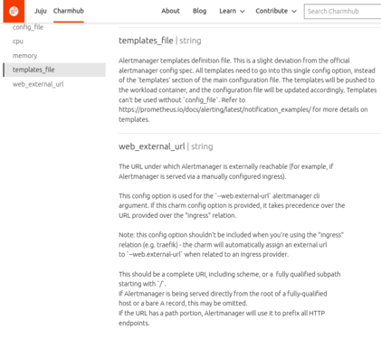

# Standards

- [Charm Configuration Option Description](#charm-configuration-option-description)
- [Charm Ubuntu and Python Version](#charm-ubuntu-and-python-version)
- [Handling Exceptions in Python Charm Code](#handling-exceptions-in-python-charm-code)
- [Handling Typing Issues with python-libjuju](#handling-typing-issues-with-python-libjuju)

## Charm Configuration Option Description

The charm configuration is defined in a single file named config.yaml. Each
configuration option can define a `description` that contains an explanation of
the configuration item. When a charm is published to the official repository of
charms, [Charmhub](https://charmhub.io/), this configuration file will be used
as content for the `Configure` page.

The `description` is a string type (scalar). YAML supports two types of formats
for that: block scalar and flow scalar.

The Block Scalar format has three parts: Block Style Indicator, Block Chomping
Indicator and Indentation Indicator.
More information in [YAML Multiline](https://yaml-multiline.info/).

The Block Style Indicator indicates how newlines inside the block should
behave.

- `>`  new lines will be replaced by spaces.
- `|`  new lines will be kept as newlines.

The choice affects how the Charmhub documentation is presented to the user
so it's important to format the description and choose the indicator
accordingly.

Real example: [Alertmanager k8s Charm](https://charmhub.io/alertmanager-k8s).

This is how `templates_file`and `web_external_url` configuration options are
defined in
[config.yaml](https://github.com/canonical/alertmanager-k8s-operator/blob/main/config.yaml):

```Yaml
  templates_file:
    type: string
    default: ""
    description: >
      Alertmanager templates definition file. This is a slight deviation from the official
      alertmanager config spec. All templates need to go into this single config option, instead of
      the 'templates' section of the main configuration file. The templates will be pushed to the
      workload container, and the configuration file will be updated accordingly. Templates can't
      be used without `config_file`.
      Refer to https://prometheus.io/docs/alerting/latest/notification_examples/ for more details
      on templates.
  web_external_url:
    type: string
    default: ""
    description: |
      The URL under which Alertmanager is externally reachable (for example, if
      Alertmanager is served via a manually configured ingress).

      This config option is used for the `--web.external-url` alertmanager cli
      argument. If this charm config option is provided, it takes precedence over the
      URL provided over the "ingress" relation.

      Note: this config option shouldn't be included when you're using the "ingress"
      relation (e.g. traefik) - the charm will automatically assign an external url
      to `--web.external-url` when related to an ingress provider.

      This should be a complete URI, including scheme, or a  fully qualified subpath
      starting with `/`.
      If Alertmanager is being served directly from the root of a fully-qualified
      host or a bare A record, this may be omitted.
      If the URL has a path portion, Alertmanager will use it to prefix all HTTP
      endpoints.
```

And this is how is shown in its Charmhub
[page](https://charmhub.io/alertmanager-k8s/configure):



## Charm Ubuntu and Python Version

Using inconsistent minor Python version for development, CI and production means
that, even if tests pass during development and CI, the charm may not work in
production.

When charms are running in production, the version of Python available to them
is dictated by the version of Ubuntu that it is running on. This is configured
in the `charmcraft.yaml` file under the `bases.build-on` and `bases.run-on`
keys. The CI should be configured to use the same version of Ubuntu as
configured under the `charmcraft.yaml` `bases.run-on` key. It is recommended
that local development be done on the version of Python that is shipped with
the Ubuntu version defined in `charmcraft.yaml` `bases.run-on`. The unit and
integration tests should be run on the same minor Python version as is shipped
with the the OS as configured under the `charmcraft.yaml` `bases.run-on` key.
With tox, for Ubuntu 22.04, this can be done using:

```
[testenv]
basepython = python3.10
```

This ensures that the tests are run on the same Python version as the charm
will be running in production, catching any issues related to mismatched Python
versions.

## Handling Exceptions in Python Charm Code

Uncaught exceptions in the charm code cause the charm to enter
[ErrorStatus](https://juju.is/docs/sdk/constructs#heading--statuses). The charm
will remain in ErrorStatus until the same hook is executed without raising an
exception. The charm won't be able to function properly if exceptions are not
handled correctly.

Uncaught exceptions should be avoided in charms. The juju framework does not
know how to deal with arbitrary uncaught exceptions and the feedback to users is
poor.

The charm code should handle all known errors, with catching the `Exception`
class reserved as a safeguard against unexpected exceptions. Actions should use
`event.fail` method to feedback the error. If the action can result in
inconsistent state for the charm the unexpected exception is caught and the
status set to `BlockedStatus`. This will also provide clearer feedback to the
user. For events, recoverable errors should cause the charm status should be set
to `MaintenanceStatus`, unrecoverable errors should set status to
`BlockedStatus`, preventing the charm from continuing operating from an unknown
state.

```Python
class SampleCharm(CharmBase):
  """Sample docstring."""

  def __init__(self, *args, **kwargs) -> None:
    """Sample docstring."""
    super().__init__(*args, **kwargs)

    self.framework.observe(self.on.start, self._on_start)
    self.framework.observe(self.on.sample_action, self._on_sample_action)

  def _on_start(self, event: StartEvent) -> None:
    """Sample docstring."""
    try:
      do_something(event)
      self.unit.status = ActiveStatus()
    except SomeError as err:
      handle_some_error(err)
      self.unit.status = MaintenanceStatus(f"Encountered recoverable error: {err}")
    except Exception as err:
      do_some_cleanup()
      self.unit.status = BlockedStatus(f"Encountered unexpected error: {err}")

  def _on_sample_action(self, event: ActionEvent) -> None:
    """Sample docstring."""
    try:
      result = do_action()
      event.set_results(result)
    except SomeOtherError as err:
      handle_some_other_error(err)
      event.fail(f"Failed action with error: {err}")
    except Exception as err:
      event.fail(f"Failed action with unexpected error: {err}")
```

## Handling Typing Issues with python-libjuju

In tests and elsewhere when interacting with `python-libjuju`, it is a frequent
requirement to check whether certain attributes are `None`. Doing this in many
tests reduces the readability of the code.

Instead of putting `assert ops_test.model` in individual tests, write a fixture:

```Python
@pytest_asyncio.fixture(scope="module", name="model")
async def model_fixture(ops_test: pytest_operator.plugin.OpsTest) -> ops.model.Model:
    """The current test model."""
    assert ops_test.model
    return ops_test.model
```

Instead of putting `assert hasattr(app, "units")`, write a fixture:

```Python
@pytest_asyncio.fixture(scope="function", name="units")
async def units_fixture(app: ops.model.Application) -> list[ops.model.Unit]:
    """The current test unit."""
    assert hasattr(app, "units")
    return app.units
```

This reduces code duplication which increases the readability of the tests.
